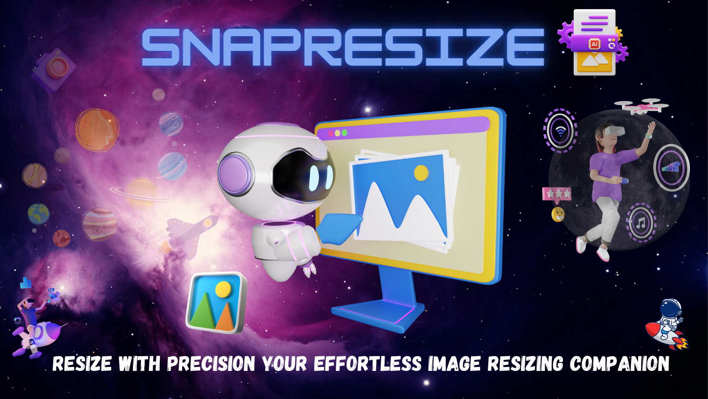
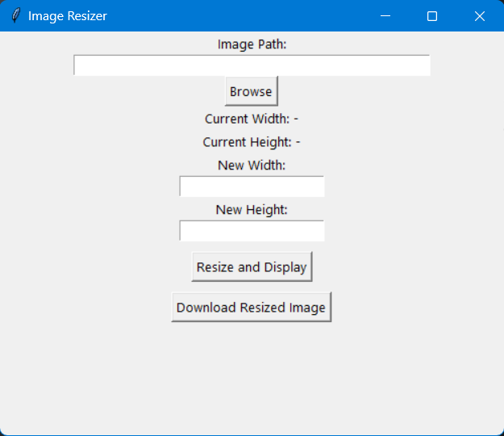

# SnapResize 🖼️

SnapResize is a user-friendly image resizing tool developed in Python. It offers a graphical interface for easy image resizing, previewing, and downloading. Whether you need to quickly adjust image dimensions or prepare images for online sharing, SnapResize has got you covered.

 

## Features ✨

- 📁 **Browse and Select:** Use the "Browse" button to pick an image from your device.
- 📏 **Custom Dimensions:** Set new width and height values for resizing.
- 🔄 **Real-time Preview:** Instantly preview the resized image before applying changes.
- 💾 **Download Options:** Save your resized image in high-quality JPEG format.

## Getting Started 🚀

1. **Clone the Repository:** Begin by cloning this repository to your local machine using the command:
   
   ```
   git clone https://github.com/Shubh2-0/snapresize.git
   ```
   
2. **Install Dependencies:** Navigate to the project directory and install the necessary libraries:

   ```
   pip install opencv-python-headless
   ```

3. **Run the Application:** Execute the app.py script to launch the GUI:

   ```
   python app.py
   ```
   
4. **Resize and Preview:** After launching the application, follow these steps:

   📌 Click **"Browse"** to choose an image.

   📌 Enter desired **width** and **height** values.

   📌 Click **"Resize and Display"** to preview the resized image.

   📌 Download the Resized Image: If satisfied with the preview:

   📌 Click **"Download Resized Image"** to save the resized image.

## Demo GIF🎥

Immerse yourself in the world of SnapResize with our captivating demo GIF! Get a firsthand look at how SnapResize effortlessly transforms images, showcasing its intuitive interface and seamless resizing process. Witness its impact on different image formats, and explore the user-friendly features that make image manipulation a breeze. Join us on a visual journey through SnapResize's capabilities and unlock a new dimension of image editing possibilities.


## User Interface 📸

Dive into the world of SnapResize through our captivating screenshots, showcasing the user-friendly interface and powerful image manipulation features. Witness how effortlessly you can resize images and experience the intuitive controls that make SnapResize a go-to tool for all your image editing needs.



## Tools Used 🛠️

<table align="center">
  <tr>
    <td align="center" width="170">
      
      <br>Python 
    </td>
    <td align="center" width="170">
      
      <br>PyCharm
    </td>
    <td align="center" width="170">
      
      <br>Github
    </td>
  </tr>
 
</table>


## Contributions 🤝
Contributions are warmly welcomed! If you encounter bugs, have suggestions, or wish to add new features, please follow these steps:

🎀 Fork the repository.

🎀  Create a branch: ```git checkout -b feature/YourFeatureName.```

🎀  Commit your changes: ```git commit -m 'Adding an awesome feature'.```

🎀  Push the branch: ```git push origin feature/YourFeatureName.```

Open a pull request.

## Acknowledgments 🙏

SnapResize was made possible with the support of these amazing open-source projects:

💫 **OpenCV**

💫 **Tkinter**

🚀 We hope SnapResize enhances your image editing workflow! Happy resizing!
